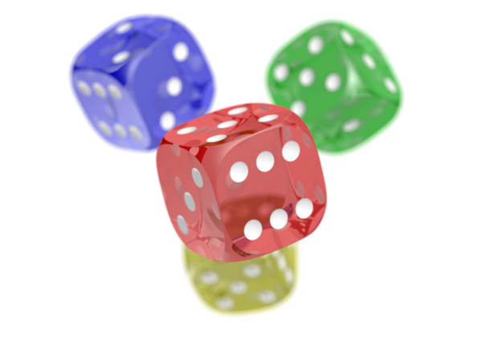

# 🌟 Guía de Viaje: Barcelona

<!-- Comentario en Markdown: README creado como proyecto educativo -->

## 📋 Índice

1. [Introducción](#introducción)
2. [Lugares de Interés](#lugares-de-interés)
3. [Gastronomía](#gastronomía)
4. [Transporte](#transporte)
5. [Consejos Prácticos](#consejos-prácticos)
6. [Información Adicional](#información-adicional)

---

## Introducción

**Barcelona** es una ciudad *vibrante* y ***cosmopolita*** situada en la costa mediterránea de España. Conocida por su arquitectura modernista, playas urbanas y rica cultura catalana, es uno de los destinos turísticos más populares de Europa 🇪🇸.

La ciudad fue fundada como colonia romana llamada *Barcino* en el siglo I a.C.[^1] y ha evolucionado hasta convertirse en la segunda ciudad más poblada de España, con aproximadamente 1.6 millones de habitantes.

<div class="alert alert-block alert-info">
  Barcelona es la capital de Cataluña y tiene dos idiomas oficiales: catalán y español.
</div>

<!-- Comentario: La siguiente sección describe los principales lugares turísticos -->

---

## Lugares de Interés

[⬆️ Volver al índice](#-índice)

### Arquitectura de Gaudí

Barcelona es famosa por las obras del arquitecto Antoni Gaudí[^2], declaradas **Patrimonio de la Humanidad** por la UNESCO.

#### La Sagrada Familia


La **Sagrada Família** es el símbolo más icónico de Barcelona. Esta basílica comenzó a construirse en 1882 y ~~se espera que esté terminada en 2026~~ continúa en construcción.

**Datos importantes:**
- **Altura:** 172.5 metros
- **Precio entrada:** 26€ - 33€
- **Horario:** 9:00 - 18:00 (varía según temporada)

#### Otros lugares imprescindibles

1. **Park Güell** 🏞️
   - Parque público con estructuras modernistas
   - Vistas panorámicas de la ciudad
   - Precio: 10€ (entrada general)
   
2. **Casa Batlló**
   - Edificio residencial remodelado por Gaudí
   - Fachada inspirada en formas orgánicas
   - Ubicación: Passeig de Gràcia

3. **La Pedrera (Casa Milà)**
   - Última obra civil de Gaudí
   - Azotea con chimeneas escultóricas
   - Visitas nocturnas disponibles

### Otros Lugares de Interés

* **Las Ramblas** - Boulevard peatonal más famoso de la ciudad
  * Mercado de La Boquería
  * Estatuas vivientes
  * Tiendas y cafeterías
* **Barrio Gótico** - Centro histórico medieval
* **Playa de la Barceloneta** 🏖️ - Playa urbana con ambiente animado

> [!TIP]
> Compra las entradas online con antelación para evitar largas colas en los monumentos principales.

---

## Gastronomía

[⬆️ Volver al índice](#-índice)

La cocina catalana combina tradición mediterránea con influencias modernas. Aquí te presentamos los platos típicos que ***no puedes dejar de probar***:

### Platos Típicos

| Plato | Descripción | Precio Aproximado |
|:------|:------------:|------------------:|
| Paella | Arroz con mariscos o carne | 15€ - 25€ |
| Pan con Tomate | Pan tostado con tomate, aceite y sal | 3€ - 5€ |
| Crema Catalana | Postre similar a la crème brûlée | 4€ - 6€ |
| Escalivada | Verduras asadas | 8€ - 12€ |

### Restaurantes Recomendados

Para disfrutar de la auténtica cocina catalana, visita:

- [Cervecería Catalana][cerveceria] - Excelentes tapas
- [Can Culleretes](https://www.culleretes.com/) - Restaurante más antiguo de Barcelona (desde 1786)
- **Cal Pep** - Mariscos frescos del Mediterráneo 🦐
- *Els Quatre Gats* - Histórico café modernista

[cerveceria]: https://www.instagram.com/cerveceria_catalana/

> [!WARNING]
> Evita los restaurantes en Las Ramblas, suelen ser trampas para turistas con precios elevados y calidad mediocre.

### Receta: Pan con Tomate (Pa amb Tomàquet)

```python
# Ingredientes (para 4 personas)
ingredientes = {
    "pan_rustico": "4 rebanadas",
    "tomates_maduros": "2 unidades",
    "aceite_oliva": "4 cucharadas",
    "ajo": "1 diente (opcional)",
    "sal": "al gusto"
}

# Preparación
def preparar_pa_amb_tomaquet():
    """
    Receta tradicional catalana
    """
    pasos = [
        "Tostar el pan",
        "Frotar el ajo en el pan (opcional)",
        "Frotar el tomate maduro sobre el pan",
        "Añadir aceite de oliva virgen extra",
        "Espolvorear sal al gusto"
    ]
    
    for i, paso in enumerate(pasos, 1):
        print(f"{i}. {paso}")
    
    return "¡Bon profit! (¡Buen provecho!)"

preparar_pa_amb_tomaquet()
```

<!-- Comentario: La gastronomía es uno de los puntos fuertes de Barcelona -->

---

## Transporte

[⬆️ Volver al índice](#-índice)

Barcelona cuenta con una **excelente red de transporte público** que facilita el desplazamiento por la ciudad.

### Metro 🚇

El metro de Barcelona tiene 12 líneas operativas que conectan toda la ciudad.

**Tarifas:**
- Billete sencillo: 2.40€
- T-Casual (10 viajes): 11.35€
- Hola Barcelona (2-5 días): desde 16.30€

### Otros Medios de Transporte

```javascript
// Sistema de transporte público
const transporteBarcelona = {
    metro: {
        lineas: 12,
        horario: "5:00 - 24:00 (lunes-jueves)",
        horarioFinDeSemana: "24 horas (viernes-domingo)"
    },
    autobus: {
        lineas: 109,
        frecuencia: "5-15 minutos"
    },
    bicing: {
        estaciones: 517,
        bicicletas: 7000,
        nota: "Sistema de bicicletas públicas"
    }
};

console.log(`Barcelona tiene ${transporteBarcelona.metro.lineas} líneas de metro`);
```

### Desde el Aeropuerto

1. **Aerobús** - Servicio directo al centro (6€)
2. **Metro L9 Sud** - Conexión económica (5.50€)
3. **Taxi** - Tarifa fija 39€ al centro
4. **Renfe** - Tren de cercanías (4.60€)

> [!IMPORTANT]
> Guarda tus billetes de transporte hasta salir de la estación. Las multas por no tener billete válido son de 100€.

---

## Consejos Prácticos

[⬆️ Volver al índice](#-índice)

### Mejor Época para Visitar

La ***mejor época*** para visitar Barcelona es en **primavera** (abril-junio) u **otoño** (septiembre-octubre), cuando el clima es agradable y hay menos turistas.

**Temperaturas medias:**

| Estación | Temperatura | Características |
|:---------|:-----------:|:----------------|
| Invierno | 10°C - 15°C | Suave, pocas lluvias |
| Primavera | 15°C - 22°C | Ideal para turismo |
| Verano | 25°C - 30°C | Caluroso, playas llenas |
| Otoño | 18°C - 23°C | Agradable, menos gente |

### Seguridad

Barcelona es generalmente segura, pero ten cuidado con:

* **Carteristas** en zonas turísticas (Las Ramblas, Metro, Sagrada Familia)
* No dejes objetos de valor visibles en el coche
* Usa bolsos cruzados y guarda el móvil en lugares seguros

> [!CAUTION]
> Los carteristas suelen trabajar en grupos. Si alguien te distrae, verifica inmediatamente tus pertenencias.

### Frases Útiles en Catalán

```text
Bon dia! - ¡Buenos días!
Adéu - Adiós
Si us plau - Por favor
Gràcies - Gracias
Perdoni - Disculpe
Quant costa? - ¿Cuánto cuesta?
No parlo català - No hablo catalán
```

### Aplicaciones Recomendadas 📱

1. **TMB App** - Transporte público de Barcelona
2. **Citymapper** - Rutas y horarios
3. **Google Maps** - Navegación
4. **TheFork** - Reservas de restaurantes con descuentos

---

## Información Adicional

[⬆️ Volver al índice](#-índice)

### Festividades Importantes

Barcelona celebra numerosas festividades a lo largo del año:

- **Sant Jordi** (23 de abril) 🌹📚 - Día del libro y la rosa
- **La Mercè** (24 de septiembre) - Fiesta mayor de Barcelona
- **Verbena de Sant Joan** (23 de junio) - Celebración del solsticio de verano
- **Navidad** - Mercados navideños y Fira de Santa Llúcia

### Museos

```html
<!DOCTYPE html>
<html lang="es">
<head>
    <title>Museos de Barcelona</title>
</head>
<body>
    <h1>Principales Museos</h1>
    <ul>
        <li>Museu Picasso - Arte de Pablo Picasso</li>
        <li>MNAC - Arte catalán</li>
        <li>Fundació Joan Miró - Arte contemporáneo</li>
        <li>MACBA - Arte contemporáneo</li>
    </ul>
</body>
</html>
```

### Fórmulas Útiles

Para calcular el presupuesto diario aproximado:

Presupuesto = Alojamiento + Comida + Transporte + Actividades

Donde:
- Alojamiento: 50€ - 150€ por noche
- Comida: 30€ - 60€ por día
- Transporte: 5€ - 15€ por día
- Actividades: 20€ - 50€ por día

**Presupuesto medio**: 105€ - 275€ por persona/día

> [!NOTE]
> Los precios pueden variar significativamente según la temporada y el tipo de alojamiento elegido.

### Datos Curiosos 🤔

- Barcelona tiene más de **4.5 km de playas** urbanas
- El Camp Nou tiene capacidad para **99,354 espectadores**, siendo el estadio más grande de Europa
- La ciudad albergó los **Juegos Olímpicos de 1992**[^3]
- Barcelona es la **4ª** ciudad más visitada de Europa
- El Barrio Gótico contiene restos de la muralla romana del siglo I a.C.

### Enlaces de Interés

Recursos útiles para planificar tu viaje:

- [Turisme de Barcelona](https://www.barcelonaturisme.com/) - Sitio oficial de turismo
- [TMB](https://www.tmb.cat/) - Transporte Metropolitano de Barcelona
- [Sagrada Família Tickets](https://sagradafamilia.org/)
- Consulta las [previsiones meteorológicas][tiempo] antes de viajar

[tiempo]: https://www.aemet.es/es/eltiempo/prediccion/municipios/barcelona-id08019

### Contactos de Emergencia ☎️

- **Emergencias:** 112
- **Policía:** 091
- **Ambulancia:** 061
- **Bomberos:** 080
- **Información Turística:** 010

---

## Conclusión

Barcelona es una ciudad que combina historia, cultura, gastronomía y vida mediterránea como ninguna otra. Desde la arquitectura modernista de Gaudí hasta las animadas playas de la Barceloneta, pasando por el encanto medieval del Barrio Gótico, cada rincón de la ciudad ofrece algo especial.

Ya sea que vengas por el arte, la comida, la arquitectura o simplemente para disfrutar del ambiente mediterráneo, Barcelona ***nunca decepciona*** 😊.

**¡Bienvenidos a Barcelona! o como dicen los catalanes: *Benvinguts a Barcelona!*** 🎉

---

### Créditos

Última actualización: Octubre 2025

**Nota química:** La fórmula del mar Mediterráneo es H~2~O + sal + sol = ¡felicidad! 🌊☀️

**Nota matemática:** La altura de la Sagrada Família (172.5m) es exactamente 1 metro menos que el Montjuïc, ya que Gaudí creía que la obra humana no debía superar la obra divina.



---

[⬆️ Volver al índice](#-índice)

---

## Referencias

[^1]: Antoni Gaudí (1852-1926) fue un arquitecto español, máximo representante del modernismo catalán.

[^2]: Información histórica según "Historia de Barcelona" por Jordi Nadal (Editorial Anagrama, 2010).

[^3]: Los Juegos Olímpicos de Barcelona 1992 fueron considerados los más exitosos hasta esa fecha y transformaron completamente la ciudad.